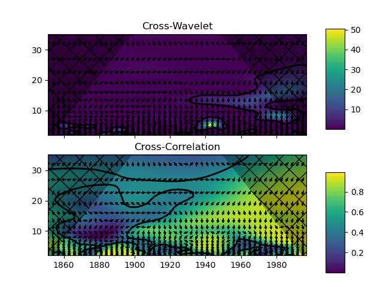

# Getting started

This guide illustrates how to use this package to perform continuous wavelet spectral analysis. We base our examples on the analysis presented by Torrence and Compo (1998)[^1] and we assume that you have a good understanding of the key concepts.

Please refer to the [installation instructions](./installation.md) for installing `pycwt`.

The `pycwt` package contains a collection of routines for wavelet transform and statistical analysis via the Fast Fourier Transform (FFT) algorithm, as well as cross-wavelet transforms and wavelet coherence tests.

[^1]: Torrence, C. and Compo, G. P.. A Practical Guide to Wavelet Analysis. Bulletin of the American Meteorological Society, *American Meteorological Society*, **1998**, 79, 61-78. DOI [10.1175/1520-0477(1998)079<0061:APGTWA>2.0.CO;2](http://dx.doi.org/10.1175/1520-0477(1998)079%3C0061:APGTWA%3E2.0.CO;2).


## Basic wavelet analysis

```python
import pycwt
nino3 = pycwt.load_dataset("sst_nino3")  # Load sample time-series.
wavelet = pycwt.Morlet(w0=6)             # Instantiate mother wavelet.
result = wavelet.run(nino3)              # Run wavelet analysis.
result.plot()
```


!!! note

    Here, it is expected that `nino3` is of type `pandas.Series`, has a constant sampling frequency `dt`, no data gaps (`NaN` values) and that time is given by the series `index`.


    **Parameters** -- The default scale and significance parameters for this analysis are:

    * Starting scale: `s0 = 2 * dt`
    * Spacing between discrete scales: `dj = 1 / 12` -- twelve sub-octaves per octave.
    * Number of scales: `J = 7 / dj` -- seven powers of two with `dj` sub-octaves.
    * Lag-1 autocorrelation for red noise: `alpha = 1`.
    * Significance level: `significance_level = 0.95`.


    **Methodology**

    1. Normalization: detrending, Z-score normalization
    2. Calculate continuous wavelet transform
    3. Significance tests
    4. Plot results


## Basic cross-wavelet analysis

```python
import pycwt
jao = pycwt.load_dataset("jao")          # Load Artic-Oscillation time-series.
jbaltic = pycwt.load_dataset("jbaltic")  # Load Baltic Sea ice extent time-series.
wavelet = pycwt.Morlet(w0=6)             # Instantiate mother wavelet.
result = wavelet.run(jao, jbaltic)       # Run cross-wavelet analysis.
result.plot()
```

